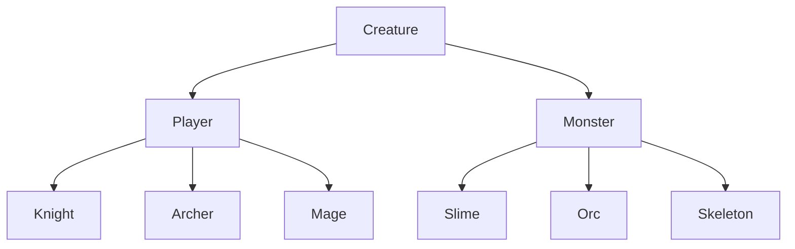

# TextRPG 만들기 OOP

> 인프런 `Rookiss`님의 [<C#과 유니티로 만드는 MMORPG게임 개발 시리즈 Part1:C#기본문법>](https://inf.run/CJG3) 내용을 보고 공부목적으로 작성한 글 입니다.

## TextRPG2 - Player 생성 
- [ ]  `Class` 분리하기
    - [ ]  `Plaeyr.cs`
    - [ ]  `Monster.cs`

### Player class
- [ ]  `enum` `PlayerType`   만들어주기
    - [ ]  `None`, `Knight`, `Archer`, `Mage`
- [ ]  **in the class Player**
    - [ ]  `protected` 로 `int hp`, `attack` 선언해주기
- [ ]  `Player`를 상속받는 Knight, Archer, Mage Class 만들어주기
    - [ ]  각각의 `생성자` 만들어주기
- [ ]  `PlayerType` 을 각각의 `직업 class`에 넣어주기
    - [ ]  부모 클래스 Player에서 `protected`로 `PlayerType` `type` 선언
    - [ ]  `Player`를 생성할 때는 무조건 `PlayerType`이 있도록 `인자` 설정 (인자 없는 버전을 차단)
    ** PlayerType이 없는 Player가 생성되면 Knight, Archer, Mage도 아니게 되니까
    - [ ]  부모클래스 `Player`에서 `PlayerType` `type` 버전을 받는 `생성자` 만들기
        - [ ]  보호수준은 `protected`
        
        ```csharp
        protected Player(PlayerType type)
        {
        this.type = type;
        }
        ```
        
    - [ ]  부모님 생성자를 사용하는 것으로 하기
        - [ ]  `public Knight() : base(PlayerType.Knight)    {        }`
- [ ]  외부에서 `hp`, `attack` 을 넣어주는 방식으로 설계
    - [ ]  `부모 클래스` `Player`에서 `SetInfo` 함수로 멤버변수 접근하는 함수 만들어주기
        
        ```csharp
        public void SetInfo(int hp, int attack)
        {
        	this.hp = hp;
        	this.attack = attack;
        }
        ```
        
    - [ ]  외부에서 접근하는 용도로 각 속성을 `Get 함수`로 만들어주기
        
        ```csharp
        public PlayerType GetPalyerType() { return type; } 
        public int GetHP() { return hp; } 
        public ing GetAttack() { return attack; } 
        public bool IsDead() { return hp ≤ 0; }
        public void OnDamaged(int damage) 
        {  
            hp -= damage;
            if (hp < 0 ) 
                hp = 0; 
        }
        ```        
- [ ]  부모 클래스 멤버 변수들에 기본값 넣어주기
- [ ]  `자식 클래스` 각 직업별로 능력치 넣어주기
    - [ ]  `SetInfo` 함수 사용
    `SerInfo(100, 10);`

## TextRPG2 - 몬스터 생성
### `Creature` `클래스`를 추가

- [ ]  `Player` 클래스와 `Monster` 클래스가 갖는 공통적인 기능과 속성을 관리 
  코드 재사용을 위해서

```csharp
protected int hp = 0;
protected int attack  = 0;

public void SetInfo(int hp, int attack)
{
    this.hp = hp;
    this.attack = attack;
}

public int GetHP() { return hp; }
public int GetAttack() { return attack; }
public bool IsDead() { return hp <= 0; }
public void OnDamaged(int damage)
{
    hp -= damage;
    if (hp < 0)
        hp = 0;
}
```

- [ ]  `Creature` 클래스가 `Player` 인지 `Monster`인지 알아야 하니까 `구조체` `enum` 추가

```csharp
public enum CreatureType
{
	None,
	Player = 1,
	Monster = 2
}
```

- [ ]  class `Creature` 에서 구조체를 인자로 받는 생성자 설정

```csharp
CreatureType type;

protected Creature(CreatureType type)
{
	this.type = type;
}
```

- [ ]  `Creature Type`을 `Get 함수`로 외부접근 할 수 있게 해주기
- [ ]  `상속` 해주기



- [ ]  `Player` `생성자`에서 `base`키워드 설정하여 인자 설정하기

```csharp
protected Player(PlayerType type) : base(CreatureType.Player)
{
    this.type = type;
}
```

### `Mosnter` class 설계

- [ ]  `MosnterType` 구조체 설정
    
    ```csharp
    public enum MonsterType
    {
    	None = 0,
      Slime = 1,
      Orc = 2,
      Skeleton = 3
    }
    ```
    
- [ ]  `Monster` 클래스 내 구조체를 인자로 받는 `생성자` 설정
- [ ]  Player 클래스와 마찬가지로 `GetMonsterType` 설정
- [ ]  `Slime`, `Orc`, `Skeleton` 각각의 `클래스`를 만들어준다
    - [ ]  `생성자`도 추가
- [ ]  `SetInfo`로 수치를 적용해주자

### `Main` 에서 사용

```csharp
Player player = new Knight();
Monster monster = new Orc();
```

- [ ]  플레이어가 몬스터를 공격하는 코드 작성 후 디버깅

```csharp
int damage = player.GetAttack();
monster.OnDamaged(damage);
// player한테 맞았는지가 중요하다 하면 OnDamaged 함수 수정해서 크리처타입 넣어주기 
```

- [ ]  `객체지향`이니까 조립해서 다른 기능도 가능
    - [ ]  `PvP` 기능
    
    ```csharp
    Player player = new Knight();
    Monster monster = new Orc();
    
    Player player2 = new Archer(); 
    int damage = player.GetAttack();
    player2.OnDamaged(damage); 
    ```
## TextRPG2 게임진행 
- [ ]  `Game` 이라는 `클래스`로 관리
    - [ ]  Game Manager 역할
    - [ ]  구조체 `enum`으로 `게임모드` 나누기 { `로비입장`, `마을입장`, `필드입장`}  세가지 경우의 수
    
    ```csharp
    public enum GameMode
    {
    	None,
    	Lobby, 
    	Town,
    	Field
    }
    ```
    

### class Game

- [ ]  구조체 변수 선언
    - [ ]  `GameMode.None` 으로 설정할 시, 아무 모드도 선택되지 않아서 아무런 동작을 하지 않음
    Set 함수로 설정해도 되지만 여기서는 처음 모드 시작을 `Lobby`로 강제 설정
    
    ```csharp
    private GameMode mode = GameMode.Lobby;
    ```
    
- [ ]  `Process 메소드` 만들기
    - [ ]  `switch` 문을 이용한 `mode` 분기
    
    ```csharp
    public void Process()
    {
    	switch (mode)
    	{
    		case GameMode.Lobby;
    			ProcessLobby();
    			break;
    		case GameMode.Town;
    			ProcessTown();
    			break;
    		case GameMode.Field:
    			ProcessField();
    			break;
    	} 
    }
    ```
    

### `switch` 문 안에서 실행될 각가의 `모드(mode) 메서드` 만들어주기

#### `public void ProcessLobby( )` 

```csharp
Console.WriteLine("환영합니다 OOO World 입니다");
Console.WriteLine("[1] 기사");
Console.WriteLine("[2] 궁수");
Console.WriteLine("[3] 마법사");
Console.Write("직업을 선택해주세요 : ");

string input = Console.ReadLine();
```

- [ ]  다시 이제 `switch` 문을 활용하여 분기를 해준다
    
    ```csharp
    switch(input)
    {
      case "1":
          // new Knight();
          Console.WriteLine("당신의 직업은 [기사] 입니다");
          break;
    }
    ```
    
- [ ]  이 switch 분기 안에서  `Knight, Archer, Mage` 각각의 Player `객체`를 생성해주면 User 입력에 따라서 직업 선택이 가능
- [ ]  그런데 굳이 여기서 `Player`를 `스택메모리` (함수) 안에다가 만들어줄 필요가 있을까 → 없다!
- [ ]  **함수 안에서 선언이 아니라 클래스 `Game` 안에다가 `Player`를 선언해주자**

```csharp
private Player player = null;
// Player 가 어떤 타입일지 모르니까 player 타입으로 받음 
```

- [ ]  다시 이제 `switch` 문을 활용하여 분기를 해준다
    - [ ]  `Knight, Archer, Mage` 생성
    - [ ]  `while`문으로 감싸지 않고, `GameMode`로 관리해서 옳바른 값이 입력되면 바로 `다음 모드`로 넘어갈 수 있도록

```csharp
switch(input)
{
	case "1":
	player = new Knight();
		mode = GameMode.Town;
		break;
	case "2":
		player = new Archer();
		mode = GameMode.Town;
	break;
	case "3":
		player = new Mage();
		mode = GameMode.Town;
	break;
}
```

#### `ProcessTown()` 함수 만들기 

- `ProcessLobby, ProcessTown` 다 `public` 으로 선언하긴 했지만, `private`으로 선언해주어도 문제없음
- 어차피 모든걸 다 관장하는 **`Process() 메서드`가 public으로 선언되어 있고, 외부에서 사용될 용도니까**
- [ ]  환영메시지 띄우기
- [ ]  필드로 가기, 돌아가기

```csharp
private void ProcessTown()
{
  Console.WriteLine("마을에 들어왔습니다");
  Console.WriteLine("[1] 필드로 가기");
  Console.WriteLine("[2] 로비로 돌아가기");
  Console.Write(" : ");

  string input = Console.ReadLine();
	switch(input)
	{
	case "1":
		mode = GameMode.Field;
		break;
	case "2":
		mode = GameMode.Lobby;
		break;
	}
}
```

### Main 함수에서 테스트

```csharp
Game game = new Game();
while (true)
{
	game.Process(); 
}
```